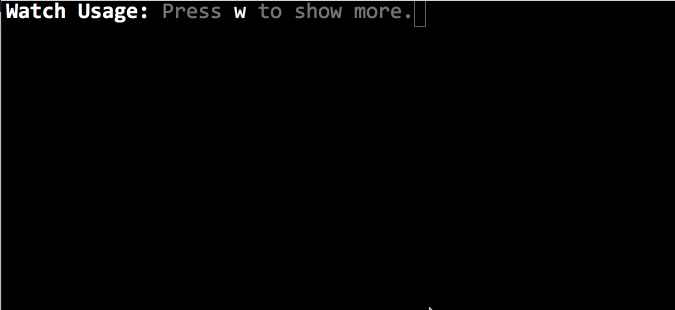
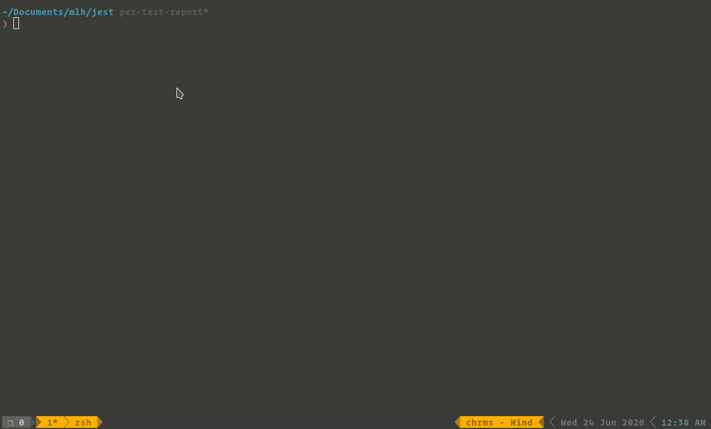

## Authors
- [Saurav M. H](https://twitter.com/sauravmh)
- [Kunal Kushwaha](https://twitter.com/kush_kunal)

## What is MLH Fellowship?

The MLH Fellowship is an internship alternative for software engineers, with a focus on Open Source projects. Instead of working on a project for just one company, students contribute to Open Source projects that are used by companies around the world. It is a great way to get real-world software development experience from the comfort of your home. The open-source community is very helpful and encourages new developers to take part in their organizations. One gains exposure, can test their skills, gain knowledge, and bond with the community to produce quality code that helps people around the world.

## How is it different from other Open Source programs?
At the beginning of the program, fellows are placed into small groups called “pods” that collectively contribute to the assigned projects as a team under the educational mentorship of a professional software engineer.  Apart from work, the fellowship program also provides opportunities to build a network and have fun while doing so! Students get to work on the latest Open Source technologies and are matched with projects according to their skills and interest, providing students with a learning opportunity while contributing to real-world projects. But, it’s not just about coding. Soft-skills and team-building exercises are conducted by MLH regularly, in addition to technical hands-on workshops! It’s a remote opportunity but provides a global platform for students to showcase their skills. During the Fellowship, we contributed to the Facebook/Jest project. 

## What is Jest?

Well, this was the opportunity we were presented at the start of the fellowship. We were over the moon to have got this project!

Jest is a JavaScript testing framework designed to ensure the correctness of any JavaScript codebase. It allows you to write tests with an approachable, familiar, and feature-rich API that gives you results quickly. Jest is well-documented, requires little configuration, and can be extended to match your requirements. Jest makes testing delightful. 

## Where did we start? 
- Before contributing to any open source projects, you must use it. You would find it very difficult to contribute if you don't know what the project is supposed to be doing. That's how we started. Using Jest to write our tests for applications we had created before. 
- Following the first week of the MLH fellowship, we had a meeting with the contributors of Jest to better understand the roadmap of the tasks and projects assigned to us. It was a productive session and helped us gain insight into the project. Reaching out to the contributors is highly recommended if you get stuck while contributing to any open source project. You can reach out to the community members via the mailing list. 
- The next stage was understanding how the project works. This was the week of diving deep into the code base of Jest. The documentation & conference talks come in handy while doing so. Since you are working on the project as a beginner, it is always a good idea to provide future contributors a form of guide that will help them in contributing, just like we are doing with this blog! Another way of getting familiar with the project is debugging the workflow & taking notes via discussions to further research upon. Coming to how to start making contributions, it is suggested that one starts with some beginner-friendly issues if they are new to the project. This is a great way to get some momentum going and getting familiar with the contribution guidelines as well. 

## Do we need to master using Jest to contribute? 🤞
- You don't need to be an expert to contribute to Open Source. If you are a beginner, you can surely find projects that can help you grow your skillset and get real-world software development experience. If there is a learning curve involved, like there was in Jest for us, that is a good thing because now you have a learning opportunity while making contributions. 
- Coming to the point of how to understand such large codebases? Well, you don't. The project is divided into individual packages that make it easier for you to navigate and explore the codebase. You can have a general idea about the workflow. You can dive deep into packages separately when required to contribute to it. For this, you can take a look at the issues section of the GitHub repository, and filter issues with easy to get started ones. And ofc, if you get stuck anywhere, the community is there to help you!

## Okay, I know the bug/feature proposal. Where do I start making changes? 🤔

- It starts by opening up an issue. Your issue should be well documented and explain the motivation behind it. If you are requesting a new feature, you should mention what the feature is, how one can go forward to implement it & why it is important. If your issue relates to solving a bug, you should mention how to reproduce that bug. What changes are breaking due to it & what the expected behavior should be? You should have a detailed explanation of what you want to achieve and how to achieve it. Ask for feedback on your issue from the community members to get more insights on it.
- Documenting is crucial as it helps others help you. If you are already familiar with how to solve the issue, you can open a pull request for the same. Documentation plays an important role here as well. You should mention what changes you made and why. What issues you were facing and how you fixed them. If the change that you have made is going to affect the existing codebase. And remember, don't forget to add a line in the logs!

## The workflow of a test run 🚀
I believe this post by Kunal does justice to it [[Jest-architecture]](https://dev.to/kunal/jest-architecture-24fp)

## The importance of community 👥

- In your open source journey, the community will play a very important role. The sole purpose of having a community is to make collaborations and learning easier for everyone. This lets us create software that is used and. contributed to by people around the world. From a beginner's point of view, your interaction with the community is what's going to help you at most times. In times when you are facing a blocker, need more input and suggestions on a particular topic, or want to get your PR reviewed, the community members are the ones who will point you in the right direction as they know the project inside out. Your peers are also a major motivation. Taking an example of the pair programming sessions/debugging we had, helped us resolve bugs (more about that later) in a faster and efficient way. 

## How to ask questions & request feedback

- Don't just say Hi in chat! This can’t be stressed enough. Everyone is quite busy with their lives, including you. So add a short and concise form of your question in the discussion channels. Tag an appropriate person (look at the channel rules first).
- Try providing links or short-reproducible forms of your problem to the other person. This increases the chance of your question getting more attention and solved sooner.
- Ask 10 short questions instead of a long one (not too short). Asking concise questions helps the person in receiving an answer sooner, as not much time is spent in understanding the context of the text as compared to say a long question.
- This brings us to another good point, break large PRs into smaller ones if possible! This is highly encouraged as it helps the reviewer understand the changes in a more simplified way and this breaking down of process leads to effective discussions and feedback. 
- Mention the steps to reproduce the error in your message, so that others can know what you are dealing with. Also mention what you tried to fix it, and what it led to, to avoid duplicate answers and things like "I already tried that".
- Requesting feedback is important when making contributions. Showcase your work in a well-defined manner, so that it is clear what you had tried to achieve. This includes providing information about changes you made and how it affects the functionality of the code. 
- Code readability is also very important. Following the organization standard, providing comments where necessary, is required. 
- Don't spam the channel if you don't get a reply immediately. Be patient and wait for the appropriate amount of time before asking again. 

<hr>

So it was the end of a general contribution guide for opensource. Let's take a deep dive into how we tackled our problems and some tips with Facebook's Jest project

<hr>

## New Feature: **Reporting individual tests**

[PR 10227](https://github.com/facebook/jest/pull/10227)

- Sometimes for bringing in a new feature you will have to go through the majority of the child repos and may get overwhelming. It is pretty normal for monorepo projects. In this case, make a rough chart or flow diagram so you know what you are doing and not get lost in the huge project.
- Okay okay, we had one tiny advantage here. The problem was already discovered. I cannot stress enough how much a well-defined problem is equally important as compared to its devised solution.

### The problem:

- It seems like Jest currently only reports progress when a complete suite passes. We propose that instead, it should report progress every second for individual test cases. (well we made it much better than per-second, more on it later)
- Otherwise, the progress output is confusing. "Tests: N" being a separate line in the output gives the impression that it's just as granular as "Test Suites: N" and will be incremented immediately when a test case passes.
- So the problem text alone can be confusing. And you bet just reading the above statement is not enough. So, here comes an explanatory image


### The solution

#### Breaking the issue into separate features
- Support sending Custom Messages to the parent from a worker thread
- Report the progress for individual test cases


#### Support sending Custom Messages to the parent from worker threads
- It adds the `jest-worker` ability for workers to send "custom messages" to their parent while they are still running. This will eventually allow us to report per test case updates to the reporter.
- This part was particularly tricky, as there were some legacy code which was very confusing to work with (pretty common with huge codebases)
- Leveraged the introduction of eventEmitters in Nodev10 (used `emittery` which is a typed form of node eventEmitters) to send the messages instead of using the traditional callbacks.
- The emitter was used only for parallel runs (supporting worker threads). For in-band runs, there wasn’t much modification needed.
- Modifying a major chunk of the `jest-worker` module, this PR was landed without any breaking change.


#### Report the progress for individual test cases

- **The proposed feature:**
  - Initially, jest runs would update testSuites incrementally, and update individual test cases batch-wise. This PR attempts to report the progress of the individual (atomic) test-cases.
  - Supported only for `jest-circus` runner.
  - Introduces eventListeners for the worker processes to send back the test results to their parent using `emittery`
  - Handles progress reports both when running tests parallelly (spawning workers) and inBand (Sequentially).
- Again the proposal is incomplete without a demonstration for it


#### Finding bugs is a learning opportunity - The Memory Leak

- **How did we find it?**
  - Thankfully there was a memory leak test inside jest. Essentially it created a shallow copy of the objects and then deleted all the references (or edges) to this node. (I refer to the node here in global object heap context.) If the object was still not garbage collected then it means there is a memory leak because there are still other objects referencing it. This is essentially how memory leak is detected. Fortunately, we don’t have to code this manually, someone has already built an npm module for it.

- **What we tried and for how long?**
  - Oh boy! This was the most tiresome part. Knowing how the memory leak worked was not enough to debug this. At first, we tried manually finding any naive mistakes in the codebase, but it was of no avail.
  - Next thing, we took the memory snapshots at various intervals while running tests. Here we run the tests inBand, so it's easier to understand where things are going wrong. 
  - Then we profiled these snaps and tried finding useful information here. No luck here too. 
  - Did a heap memory log of the tests, but nothing out of the blue here too.
  - Now, we used the oldest recipe in the cookbook, as recommended by the master chefs. NUKING THE CODES! (kudos to [@taneliang](https://twitter.com/taneliang) for finding this hidden recipe)
  - We started removing chunks of codes, to see if which part was causing the issue. This was our last resort and we started with the place we thought was most vulnerable to the memory leak. **And, VOILA! We found it**

- **How did we fix it?**
  - We found it was due to a direct reference for the object being sent to the worker thread. And even after the worker process was orphaned, it still held the object reference with it. So, we solved this by creating a deepCyclicCopy (which is a fancy way of saying we did a deep copy of an object which may or may not have cyclic references) and sent it to the worker threads again. And yes, it worked!
  - It was a one-line fix. JUST ONE LINE!
  
  ```js
  sendMessageToJest = (eventName, args) =>
      this.eventEmitter.emit(
        eventName,
        deepCyclicCopy(args, {keepPrototype: false}),
  );
  ```


- **What did we learn?**
  - But, coming to this one line was one of the best journeys we had. We learned a lot about 
     - Chrome v8 heaps. 
     - How the garbage collection is handled internally.
     - How does Node maintain different heaps and inter-references between the worker thread it spawns. 
  - These were some of the things we learned when fixing this bug. 

# So, concluding it…
Yay! You survived the nerd blog. Here, have a cookie 🍪

Also, We are no experts here and neither is our work perfect. Just some fellows sharing their experience. You may agree or not agree with some of our points here. And it’s completely fine, we respect you for questioning our work. This is just a roadmap we took and laid, you may either tread this path or find your own. Both have their fun and hurdles :)

So that was about it. That’s how we started with a project we had never contributed to before and landed a new feature during the Fellowship. A huge shout out to all the community members, MLH fellowship team, & everyone else for being a part of this journey and empowering everyone to achieve more.

> Thanks for reading.
> 
> 

### About the Authors

#### About Kunal: 
Hello everybody! My name is Kunal and I am a junior from India. My interests include DevOps, Machine Learning, and Web Development. I have been a part of various open-source programs like the MLH Fellowship, Google Summer of Code, Google Code-I, etc. Outside of work, I am a core team member of various college societies and programming boot camps where I teach students Data Science and DevOps. I also volunteer at a community (codecau.se/yt) which I started, as an instructor, & have thousands of students learning with us.
I have been contributing to open-source since my freshman year and it has made a lasting impact on my career journey. My goals include working on products & services that have an impact on the world. Hence, I would love to work for an organization that’s leading the future of the industry.

#### About Saurav:
A friendly neighborhood developer from India. A computer Science Engineering student doing specialization in Bioinformatics. Absolutely love working on DevOps and Full Stack Web Development. Have experience working on product and platform architectures for startups. Have been part of Technical Chapters and delivered Talks on Deep Learning and Product Deployments. Keen believer of open source community. Currently part of MLH Fellowship and been an OSS contributor for 2 years.
My work was and always will be driven towards making people’s life easier and building products that create a difference. To sum it up, I love my Arch and OpenSource :)