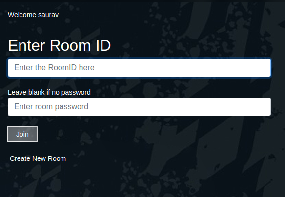
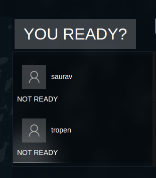
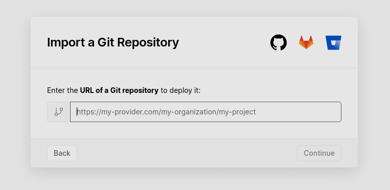
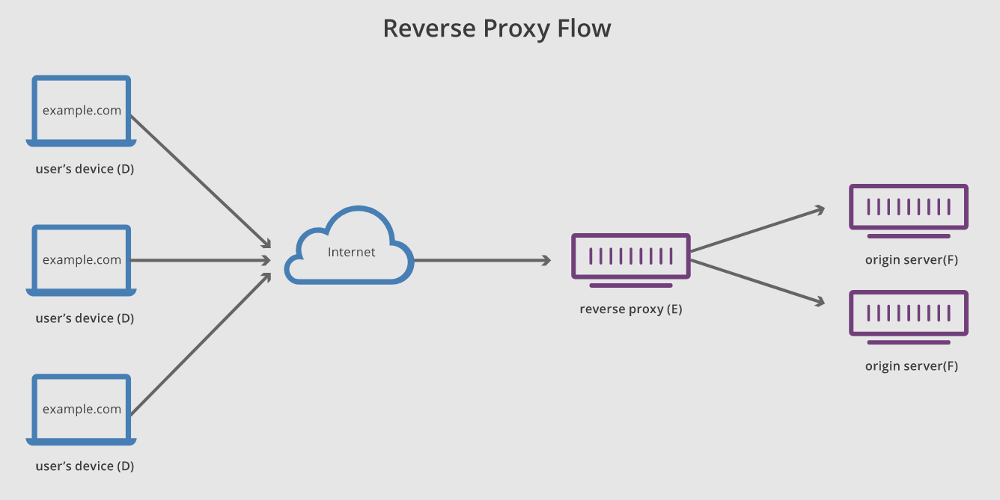
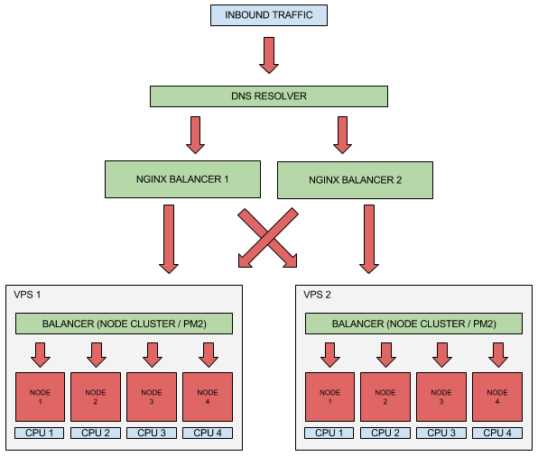
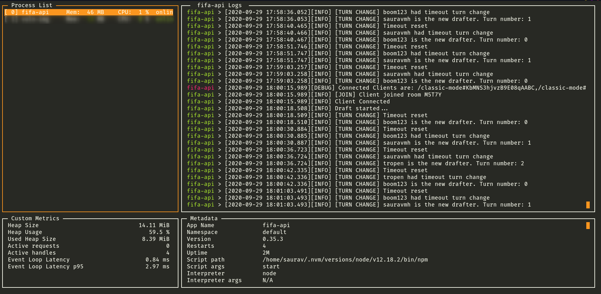

I would definitely recommend you to read the first article before we continue the journey here -

[Nodejs multiplayer games using socketio](https://blog.sauravmh.com/multiplayer-game-using-socketio/) 

## A gist of part 1 of the series:

In the last article, we talked about how to create a browser turn-based multiplayer game using socket.io and NodeJS. 

The topics covered were:

- Using Football Draft as an example of a turn-based game
- The server architecture overview and folder structure
- Introducing socket.io and handling exposed ports
- Creation of rooms and namespaces and some user actions

## Let's continue from where we left

We will do system design for generic turn-based games here. Let's proceed with scenarios in order of user interactions.

 1. User enters the homepage
 2. After the user creates or joins a new room
 3. Waiting till others arrive before starting the game
 4. Rotating turns
 5. Handling player exits in-game

## :wave: Users enter the homepage

This can be your welcome page. In my case, I have added one previous page reading the username/alias. Here we explain the users the rules of the game and show users a clear option to join or create a new room for them to play.

### Client Side


### BTS

You can always refer the whole documented code from my GitHub links provided at the end.

```javascript
if (this.action === 'join') {
    // @optional Check if correct password for room
    // Check if room size is equal to or more than 1
    //     If yes, join the socket to the room
    //     If not, emit 'invalid operation: room does not exist'
}

if (this.action === 'create') {
    // Check if room size is equal to zero
    //     If yes, create a new room and join socket to the room
    //     If not, emit 'invalid operation: room already exists'
}
```

## :busts_in_silhouette: After: User Creates or Joins the Room

After a user creates a room or starts a new game, a `gameState` is created for the given `roomId`. GameState is essentially a central state management section on your server. All your client actions will be validated and updated on this gameState.

The state can be a simple Javascript object or a table/collection in your database. The reasons you might want to use a database instead of a simple JS object might be:

- You have longer game sessions
    - Reason: Chances are the server instance that might restart or crash due to some reason. Using a database for the `gameState` management helps you mitigate this problem
- There are multiple server sessions running
    - Reason: It is usually a good practice to run multiple instances of your socketio or NodeJS processes when running on scale. You can check out the node cluster module for this. Scaling is explained in detail later :relieved: 

Yes, in my case I am storing state in a JS object (Stop attacking me, Jesus!). Well, I didn't think of scale at the start of the project and I'm glad I didn't go down this rabbit hole. But the silver lining is, you can easily plug in a Redis DB when initializing the socketio object. The rest will be handled by the library. But again, we want to take this a few steps further :rocket: I have explained the project scaling in detail later on in this article!

### BTS

```javascript
this.store = {
    password: '$2y$04$qE0oJbl7eixKMLhS7u6ure9wS/I1wcA.DtJOhaMe3oqsa1rQKAEO6', // Storing hash, coz well security!
    clients: [{
        id: this.socker.id, // Default socket.io client-session id
        username: this.username, // User alias/username
        isReady: false // Default
    }...]
}
```

## :clock2: Waiting time till everyone is Ready

We just can't start the game when a selected number of users join the game. Users must confirm they are ready, and once every user is ready the game starts.
*Optional - allow users to unready themselves*

### Client Side


### BTS

```javascript
/**
 * Mark player as ready  ---> to start the draft in the given room. If all players are ready then initiate the draft
 *
 * @access public
 */
isReady() {
    this.socker.on('is-ready', () => {
        // 1. Flip the player's `isReady` state to true (only for the player which emitted this event)
        // 2. If all players are ready then trigger beginDraft()
    });
}
```

## :arrows_counterclockwise: Rotating Turns

You might think of this as the core part of the game logic. We basically rotate the chance to pick items amongst the players. Think of the `clients` array as a Circular Queue. For this:

- We will first randomize the `clients` queue (`this.store.clients`) order.
- Start a timeout for each player's turn. Auto pick/don't pick an item on timeout expiry. (I have gone with no items pick on timeout expiry)
- Rotate the chances on the whole queue, until the required number of rounds are reached
- Update the `gameState` on every update from the player turn.

Again, the above steps are just my game logic. You can tweak them according to your requirements. Just make sure the `gameState` is up-to-date after each user action. You might run into consistency issues otherwise

### BTS

```javascript
 /**
 * Consume player item and update the gameState. Reset the timeout and initiate the next turn.
 *
 * @access    public
 */
shiftTurn() {
    this.socker.on('player-turn-trigger', (selectedItem) => {
        if (currentChance.id === this.socker.id) {
            // 1. Update the gameState
            // 2. Add the selectedItem to the userItems list
            // 3. resetTimeout()
            // 4. trigger nextTurn()
        }
    });
}
```

## :no_entry_sign: Handling Player Exits inGame

It is very important to handle player exits inGame. The user may choose to exit using the in-game menu or just close the application or his/her internet connection might just die (poor lad! we all have been there). Under all these circumstances it is important to make sure your application doesn't crash. This may affect other players' games.

For our case we need to:
- Clear all the timeouts inGame
- Broadcast the last synced list of items for all users in the current room
- Reset the current `gameState` or continue the game by removing `disconnected-user` from the player queue

# Deploying the application

## CI/CD for React Application


<figcaption> Add your GitHub URL and click to deploy </figcaption>

This is the easiest deployment stage of the pipeline. You can use Vercel/Netlify or other free (I do mean generously free!) auto build and deploy tools. You just need to add your GitHub project URL on the Vercel dashboard and click deploy (yes indeed very easy).

## Deploying the HTTP and Websockets Server

Before discussing the "continuous" part of CI/CD, let's see how do we set up the deployment.

TLDR;
We will be using Nginx as a reverse proxy server, creating two virtual hosts: one for HTTP requests and another for WebSockets requests.

It's okay if you didn't understand some or any part of the above. Even if you did, and are curious about the details, I will be elaborating the same with concise examples.

## What is Nginx?

It is a web server that can be used as a reverse proxy, load-balancer, mail-server, handling cache, etc. It handles large amounts (up to millions) of requests and yet is light-weight and super-modular to use.

But, for our use case, we will be using Nginx as reverse-proxy. Before you ask,

> A reverse proxy is a server that sits in front of one or more web servers, intercepting requests from clients.
> 
> 
 
## Creating Virtual Hosts

Virtual Hosts are more of an Apache (It's a webserver just like Nginx) Term. Nginx coins this as "server blocks"

You can point each server block to a domain/subdomain you want. Here, we are creating two subdomains:

- `soc.mydomain.com` -> Endpoint for websockets connections
- `api.mydomain.com` -> Endpoint for HTTP connections

Now, to keep the whole configuration modular, we will be following a standard folder structure.

You will see a similar recommended template in Nginx docs too, this one has additional configs which will make writing configs for each `host` a breeze!

```json
.
├── ./conf.d/
│   ├── error-pages.conf          # default error pages for each code
│   ├── gzip.conf                 # standard gzip configs
│   ├── url-filter-cgi.conf       # Filter urls to auto return error status
│   ├── real-ip-resolution.conf   # Uses real-client-ip if using cloudflare or amazon proxies
│   └── ...
├── ./vhost.d/
│   ├── api.mydomain.com.conf # HTTP config       -> user-config
│   ├── soc.mydomain.com.conf # Websockets config -> user-config
│   └── _default.conf
├── nginx.conf                    # set a global-default for nginx
├── mime.types                    # allow-list for mime types 
└── ...
```

Here, `./vhost.d/` is where we place all user-generated configs.

Now let us configure a server block for handling HTTP requests,

```json
───────┬────────────────────────────────────────────────────────────────────────────────────────────────────────────────────────────
       │ File: api.mydomain.com.conf
───────┼────────────────────────────────────────────────────────────────────────────────────────────────────────────────────────────
   1   │ server {
   2   │
   3   │   listen      80;
   4   │   listen      [::]:80;
   5   │   server_name api.mydomain.com;
   6   │
   7   │   include conf.d/error-pages.conf;
   8   │   include conf.d/url-filter*.conf;
   9   │
  10   │   location / {
  11   │     return 301 https://$host$uri$is_args$args;
  12   │   }
  13   │
  14   │ }
  15   │
  16   │ server {
  17   │
  18   │   ssl_certificate                      /my_cert_path/api.mydomain.com/fullchain.pem;
  19   │   ssl_certificate_key                  /my_cert_path/api.mydomain.com/privkey.pem;
  20   │   ssl_trusted_certificate              /my_cert_path/api.mydomain.com/chain.pem;
  21   │
  22   │   listen                              443 ssl;
  23   │   server_name                         api.mydomain.com;
  24   │
  25   │   include conf.d/error-pages.conf;
  26   │   include conf.d/url-filter*.conf;
  27   │
  28   │   root /home/saurav/my_application;
  29   │
  30   │   location / {
  31   │         proxy_pass http://localhost:3000/;
  32   │         proxy_http_version 1.1;
  33   │         proxy_set_header Upgrade $http_upgrade;
  34   │         proxy_set_header Connection 'upgrade';
  35   │         proxy_set_header Host $host;
  36   │         proxy_cache_bypass $http_upgrade;
  37   │         proxy_hide_header X-Powered-By;
  38   │   }
  39   │
  40   │ }

```

Here, we open the port 80 for internet communication, HTTP protocol to be specific. The `server_name` is the endpoint you want to create a virtual host. In simple words, the public endpoint you want to route your requests to.

We will discuss both the server blocks in detail, after the below config.

Let us take an example for configuring a WebSockets enabled server block.

```json
───────┬────────────────────────────────────────────────────────────────────────────────────────────────────────────────────────────
       │ File: soc.mydomain.com.conf
───────┼────────────────────────────────────────────────────────────────────────────────────────────────────────────────────────────
   1   │ server {
   2   │
   3   │   listen      80;
   4   │   listen      [::]:80;
   5   │   server_name soc.mydomain.com;
   6   │
   7   │   include conf.d/error-pages.conf;
   8   │   include conf.d/url-filter*.conf;
   9   │
  10   │   location / {
  11   │     return 301 https://$host$uri$is_args$args;
  12   │   }
  13   │
  14   │ }
  15   │
  16   │ server {
  17   │
  18   │   ssl_certificate                      /my_cert_path/soc.mydomain.com/fullchain.pem;
  19   │   ssl_certificate_key                  /my_cert_path/soc.mydomain.com/privkey.pem;
  20   │   ssl_trusted_certificate              /my_cert_path/soc.mydomain.com/chain.pem;
  21   │
  22   │   listen                              443 ssl;
  23   │   server_name                         soc.mydomain.com;
  24   │
  25   │   include conf.d/error-pages.conf;
  26   │   include conf.d/url-filter*.conf;
  27   │
  28   │   root /var/www/my_application;
  29   │
  30   │   location / {
  31   │         proxy_pass http://localhost:3001/;
  32   │         proxy_redirect off;
  33   │
  34   │         proxy_http_version 1.1;
  35   │         proxy_set_header X-Real-IP $remote_addr;
  36   │         proxy_set_header X-Forwarded-For $proxy_add_x_forwarded_for;
  37   │         proxy_set_header Host $host;
  38   │
  39   │         proxy_set_header X-Forwarded-Host $host;
  40   │         proxy_set_header X-Forwarded-Server $host;
  41   │
  42   │         proxy_set_header Upgrade $http_upgrade;
  43   │         proxy_set_header Connection "upgrade";
  44   │
  45   │   }
  46   │
  47   │ }
```

### The first server block

Creates a `301` redirect from the virtual host location, `soc.mydomain.com` in the above example to an https connection. If you do not require an SSL connection, you can choose to define your configs here itself.

### The second server block

- Add SSL certificates location (I use certbot to generate SSL certs, feel free to explore other options). This step is not necessary if you are using Cloudflare, Amazon, or any other edge delivery proxy services, as you can configure the certs from their portal.
- `proxy_pass`: Point to the server accepting the client requests. In our case, we are running the WebSockets backend on the same server, hence we add a proxy_pass for our localhost connection.
- `proxy_set_header`: Adding appropriate request headers. 
    - Here, we set the `Connection "upgrade"` to allow switching protocols from `polling` to `websockets`. This feature is tightly bound to `socket.io`, as they use this feature to support older browsers. You may skip this header if you are using `websockets` directly
    - `X-Forwarded-Host`: The original host requested by the client in the Host HTTP request header
    - `X-Forwarded-Server`: The hostname of the proxy server.
    - `X-Forwarded-For`: Automatically append `$remote_addr` to any incoming `X-Forwarded-For` headers.
    - `X-Real-IP`: This might be tricky to understand, but bear with me. Assume a user is at IP `A`, the user is behind a proxy `B`. Now the user sends a request to loadbalancer with IP `C`, which routes it to Nginx. After Nginx has processed the request, the requests will have the following headers:
        - `X-Forwarded-For: [A, B, C]`
        - `X-Real-IP: B`: Since Nginx will recurse on `X-Forwarded-For` from the end of the array to the start of the array, and find the first untrusted IP.
    - If `X-Forwarded-For` does not exist in a request, then `$remote_addr` value is used in the `X-Real-IP` header, otherwise, it is overwritten by recursing on the `X-Forwarded-For` header array, taking into consideration set_real_ip_from rule(s).

Now, we have seen how to configure reverse proxies to serve your application over the internet, be it HTTP requests or WebSocket connections. The next important part is how to handle the load and horizontal scaling of your application. Do we even require scaling? If yes, under what specific conditions?

All of the above questions and many others are answered in the below section.

## :rocket: Scaling your application

There are basically two kinds of scaling
- Vertical Scaling: Increasing the server capacity to handle and process more requests
- Horizontal Scaling: Increasing the server instances, to distribute and process more requests

We will be focusing more on horizontal scaling here. More specifically, focusing on scaling NodeJS applications. Even though some methods can be used for scaling other than NodeJS, details for other platform applications are out of the scope of this article.


<figcaption> Network Balancing Overview </figcaption>

### When do I scale?

- First off, make sure your NodeJs process is ONLY using asynchronous I/O. If it's not compute-intensive and using asynchronous I/O, it should be able to have many different requests "in-flight" at the same time. The design of node.js is particularly good at this if your code is designed properly.

- Second, instrument and measure, measure, measure. Understand where your bottlenecks are in your existing NodeJS server and what is causing the delay or sequencing you see. Sometimes there are ways to dramatically fix/improve your bottlenecks before you start adding lots more clusters or servers.

- Third, use the node.js cluster module. This will create one master node.js process that automatically balances between several child processes. You generally want to create a cluster child for each actual CPU you have in your server computer since that will get you the most use out of your CPU.

- Fourth, if you need to scale to the point of multiple actual server computers, then you would use either a load balancer or reverse proxy such as Nginx to share the load among multiple hosts. If you had a quad-core CPUs in your server, you could run a cluster with four NodeJS processes on it on each server computer and then use Nginx to balance among the several server boxes you had.

Note that adding multiple hosts that are load balanced by Nginx is the last option here, not the first option.

### How to scale a NodeJS application?

As mentioned, you can use the `node cluster` module. But in this example, we will be using pm2.

> PM2 is a daemon process manager that will help you manage and keep your application online


<figcaption> My pm2 monitoring on server </figcaption>

Apart from being an excellent monitoring tool for your server jobs, there are various abstractions pm2 provides which makes it the go-to manager for deployments.
It also includes `cluster mode`, which is a clean abstraction built over the `node-cluster` module.

An example use-case would be:

- Create a `deploy_processes.json` file
```json
{
  script    : "server.js",
  instances : "max",
  exec_mode : "cluster"
}
```
- Run `pm2 start deploy_processes.json`
- Run Reload after any changes: `pm2 reload deploy_processes.json`. This allows for reloading with 0-second-downtime, as opposed to `pm2 restart`, which kills and starts the process again. (*This statement is taken from the official docs, I've not made it up*)

Make sure while scaling in general, your application is **StateLess**. Do not store any information in the process or anywhere in runtime. You may use RedisDB (in-memory storage), MongoDB, or any storage of your choice to share states between the processes.

Also when scaling NodeJS applications, make sure you are not spawning many **child processes**. This just creates a lot more processes than your CPUs, causing a context switching hell for the OS.

## 🤔 Going ServerLess, are we?

Maybe. Handling scaling, errors, monitoring, and what not! becomes a pain once your application gains more users. I nowhere remotely have such a huge userbase, so I did not need serverless in my case. But it is indeed an interesting and vast field. I am currently porting this project to AWS lambdas and utilizing their other services.

Maybe I will save my server cost, maybe not.
Maybe I will have better request response times, maybe not.
Maybe I will scale this properly, maybe not.

One thing I know for sure, this path will be super interesting and a pretty good learning experience too. I had started this project with the primary focus of playing with DevOps, and I don't intend to stop now.

**If you are interested, here are my project links:**

- Backend (Websockets + HTTP) - [https://github.com/sauravhiremath/fifa-api](https://github.com/sauravhiremath/fifa-api)
- Frontend (ReactJS) -  [https://github.com/sauravhiremath/fifa](https://github.com/sauravhiremath/fifa)
- WebCrawler (Python3 + Scrapy) - [https://github.com/sauravhiremath/fifa-stats-crawler](https://github.com/sauravhiremath/fifa-stats-crawler)
