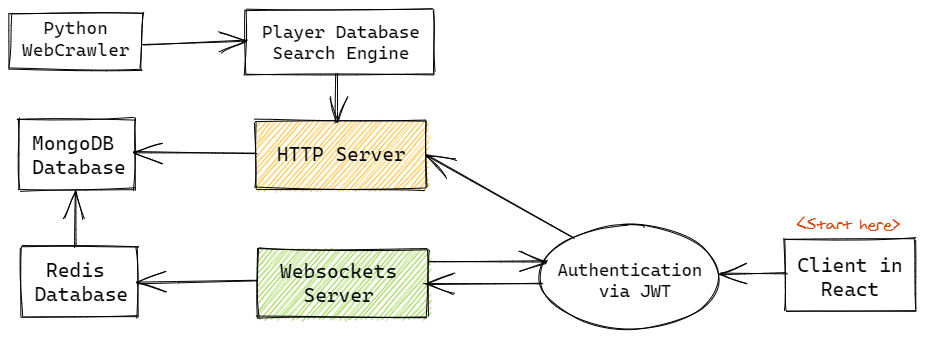

> A definitive guide for building your multiplayer game on a browser the right way using socket.io on NodeJS and React. Ranging from folder-structure to project deployments

Getting started with a unique idea is important. But it is much more crucial to set the foot in the right direction when starting with a project.

## Why another tutorial?
This is very important to clarify. There are tons of guides online focusing on “Getting started with socket.io” and it gets more frustrating when all of them are chat apps. But here we will focus on “Getting started with building a scalable project using Socket.io”, which is not a chat app :).

This guide will explain more about the Code Infrastructure rather than focusing on UI/UX. So bear with me if UI doesn’t look so appealing.

## What is socket.io?
Socket.io is an abstraction built over the WebSockets protocol. Websockets is a protocol that allows a bilateral synchronous exchange between a client and a server. Or a bi-directional communication pipe in simple words
Note: Here WebSockets and socket.io will be used interchangeably (even though they are different in some aspects) unless stated otherwise.

## Why WebSockets and not HTTP?
For real-time multiplayer games, we require the client to send information packets to the server and server sending/broadcasting data simultaneously. This can’t be achieved using HTTP as the client has to send a request to the server to actually receive something. This isn’t a viable scenario for multiplayer games.

## What do you mean by the “Right way”?
The Right way — here means getting started with a Codebase which can be easily scaled further, and simultaneously not creating much hassle for smaller projects. It addresses common practices that can be followed for a much more modular project. This in no manner states it is the official way to build WebSockets projects. But is simply my opinion on it, you can easily swap out bits and parts of the project you don’t like :D

## What is the project about? ⚡⚡
So coming to the core of the guide. This guide explains building a “multiplayer socket.io game” through a real-world project. This way it is much easier to see the project in action and we know the code/infrastructure works too! The project is…

> Multiplayer Football Draft Simulator

### What does this game do? ⚡
It is a turn-based multiplayer game. Where people enter and create a room. Other people hop into the room. Then the game begins where all players are shuffled and first-person gets the chance to pick the football-player he wants. He can search from the list of players (viewing their stats, position, ratings, and other details) and confirm his selection within the allocation time. Now, the turn is passed to another player. This repeats until every person has picked their whole football squad.

Pretty simple? Yes/no, it doesn’t matter. We will see the detailed breakdown of the code infrastructure behind this.

## Server Architecture ⚡⚡⚡



## Game architecture
The above diagram explains how everything is connected from a birds-eye point of view.

Both the HTTP and Websockets server in this guide uses NodeJS. We are using Redis DB as socket.io supports its integration out of the box also the read/write operations are much faster as data is stored in-memory. MongoDB is used as a more permanent storage solution. The game results and the user teams for each room are stored in MongoDB after the end of each draft round. It also stores user credentials if they wish to register (this project has an optional registration/login step).

The WebCrawler is written in Python3, using the Scrapy library. The football players dataset has been crawled from https://sofifa.com. It consists of more than 20,000 players including their rating, statistics, worth, clubs, etc. It also has an optional data-analysis jupyter-notebook for playing with the scraped data, but its discussion is out of scope for this guide.


### The Folder Structure (ExpressJS + MongoDB + socket.io)

NodeJS does not enforce code structure on you. This gives us a lot of flexibility to design them, but you can go horribly wrong which can lead to difficulty in maintaining and scaling the projects. This particular project structure can be used when working with sockets + NodeJS

Let's dive in how the project codebase is structured
    
    
    .{src}  
    ├── controller  
    │   ├── authController.js      # Handles authentication requests  
    │   ├── searchController.js    # Handles search queries  
    │   ├── userController.js      # Handles user profile operations  
    │   └── ...  
    │  
    ├── database  
    │   ├── db.js                  # Initialize DB connection  
    │   └── ...  
    │  
    ├── middlewares  
    │   ├── authenticated.js       # Decode and verify JWT token  
    │   ├── error.js               # Common Error Handler  
    │   ├── logger.js              # Control logging levels  
    │   └── ...  
    │  
    ├── models  
    │   ├── roomsModels.js         # DB model for rooms  
    │   ├── usersModel.js          # DB model for users  
    │   └── ...  
    │  
    ├── schema  
    │   ├── rooms.js               # DB Schema for rooms  
    │   ├── users.js               # DB Schema for users  
    │   └── ...  
    │  
    ├── socker  
    │   ├── roomManager.js         # Socket listeners/emitters handle  
    │   ├── sockerController.js    # Control socket connections  
    │   └── ...  
    │  
    ├── app.js                     # Entry file for the project  
    ├── env.js                     # Store environment variables  
    ├── routes.js                  # All routes initializer  
    └── ...

The backend is divided into different directories according to the project requirement. If you want to skip or swap certain modules, it is as easy as adding another directory.

Most of the sub-directories are common to node projects, so I won't explain them in detail here. The comments beside each directory should give an idea of what it is.

We will focus more on **subdirectory socker/**. This the place where your core socket.io code will reside.

### The entry point for socket.io (App.js)

```js
import { socker } from './socker';
import express from 'express';
import http from 'http';
import { API_PORT, host } from './env';

const app = express();
const server = new http.Server(app);
socker(server);

app.listen(API_PORT, () => {
  logger.info(`Api listening on port ${Number(API_PORT)}!`);
});

server.listen(Number(API_PORT) + 1, () => {
  logger.info(`Socker listening on port ${Number(API_PORT) + 1}!`);
  logger.info(`Api and socker whitelisted for ${host}`);
});

```

Here two servers are created, `app` — listening to HTTP requests and `server` — listening to WebSockets connections. It is recommended to keep them connected to different PORTs to avoid confusion.

You might be wondering what is "socker" on line 1 and 8.

## What is socker?

Socker is just a function alias (because I am building a football draft game here, duh!). This function attaches the `Server` (passed in line 8 of app.js) to an engine.io instance on a new `http.Server`. In simple words, it attaches the socket.io engine to the server passed to it.

```js
import socketio from 'socket.io';

export default server => {
  const io = socketio.listen(server, {...options});

  io.on('connection', socket => {
    logger.info('Client Connected');
  });

  return io;
};

```

But the above code doesn't explain much. Now, the following questions arise:

* How do I interact with connected clients?
* Where are namespaces?
* Where are the Rooms/Channels?
* Most importantly, where is the game?

## Creation of Namespaces and why?

Namespaces are an important feature of socket.io. It represents a pool of sockets connected under a given scope identified by a pathname like `/classic-mode` , `/football-draft` , `/pokemon-draft` , etc. This is basically creating different endpoints or paths. It allows us to minimize the number of resources (TCP connections) and at the same time separate concerns within your application by introducing a separation between communication channels. By default, socket.io connects to the`/` namespace.

## Creation of Rooms/Channels and why?

Within each namespace, you can create arbitrary channels or rooms. This further allows you to create connections which sockets can `join` or `leave` . Here we use `channels` to create different rooms where users can join or create to play together.

_Example of joining a room_

```js
import socketio from 'socket.io';

const io = socketio.listen(app);

const roomId = '#8BHJL'

io.on('connection', async socket => {
  // join() allows to join a room/channel
  // Here, `await` is used; as socketio join operation uses mix of async and sync operations
  await socket.join(roomId);
  
  logger.info('Client Connected');
});

```

The `join()` operation checks if the required `roomId` is already created. If not, then it creates the room and adds the player to the given roomId. And if it is already created it joins the room directly.

_A wholesome example summarizing the use of namespaces and channels:_

```js
import socketio from 'socket.io';
import Room from './roomManager';

export default server => {
  const io = socketio.listen(server, {
    path: '/classic-mode',
  });

  logger.info('Started listening!');
  
  // Creating a new namespace
  const classicMode = io.of('/classic-mode');
  
  classicMode.on('connection', async socket => {
    // Receive parameters passed from socket client
    const { username, roomId, password, action } = socket.handshake.query;
    
    // Initilaise a the room for connecting socket
    const room = new Room({ io: classicMode, socket, username, roomId, password, action });

    const joinedRoom = await room.init(username);
    logger.info('Client Connected');
    
    // Listeners opened by server
    if (joinedRoom) {
        room.showPlayers();
        room.isReady();
        room.shiftTurn();
    }

    room.onDisconnect();
  });

  return io;
};
```

That's it for Part I. The code structure shown here works for medium size projects quite well. If you are building a quick prototype, you may omit or combine the schema and models folder. Do not hesitate to make the project lighter if required :)

What if the project size increases? The current structure might not work well. You can create sub-folders as per required services and components ( `user-authentication` , `__tests__` , `analytics` , etc.). You might even create microservices i.e. deploying each process or service individually allowing you to load-balance or scale only the processes under heavy-loads.

Remember do not over-engineer your product, build and deploy in stages!

> 

Be it a joke or an engineering-project, no one likes overdoing it :)

**If you are interested, here are my project links:**

- Backend (Websockets + HTTP) - [https://github.com/sauravhiremath/fifa-api](https://github.com/sauravhiremath/fifa-api)
- Frontend (ReactJS) -  [https://github.com/sauravhiremath/fifa](https://github.com/sauravhiremath/fifa)
- WebCrawler (Python3 + Scrapy) - [https://github.com/sauravhiremath/fifa-stats-crawler](https://github.com/sauravhiremath/fifa-stats-crawler)

**Next article/articles will focus on:**

* Creation and handling of rooms for each namespace.
* A brief explanation of the client-side of the project (in ReactJS)
* CI and Deployment of each project package.
